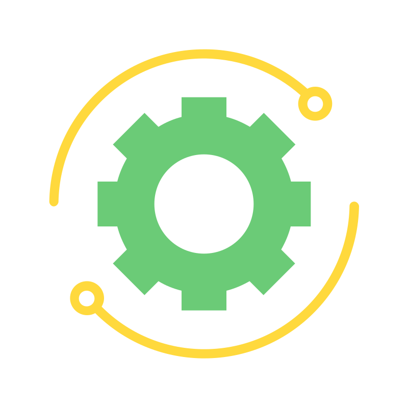

# Techno-Verse
<p align="center">
  
</p>

*We facilitate meeting between Client and Technicians*
## Live Link
[Techno-Verse](https://techno-verse.onrender.com/)
## About the Project

Describe your project in a few sentences, detailing what it does and its purpose. Mention any unique features or advantages it provides.

## Features

- Bullet point each major feature.
- Explain any specialized functionality.
- Mention what makes the project unique or useful.


## Tech Stack

- **Frontend:** List frontend tech (e.g., React, Material UI, Framer-Motion, Keep-React, Tailwind CSS, etc.)
- **Backend:** List backend tech (e.g., Firebase)
- **Database:** Mention the database used (e.g., Firebase)
- **Other:** List any additional technologies (e.g., WEBRtc, Socket.io)

## Getting Started

### Prerequisites
```bash
# Example
node >= 14.0.0
```
## Install All the Dependencies
```bash
npm install
```
## Run Locally [Dev Mode]
```bash
npm run dev
```


